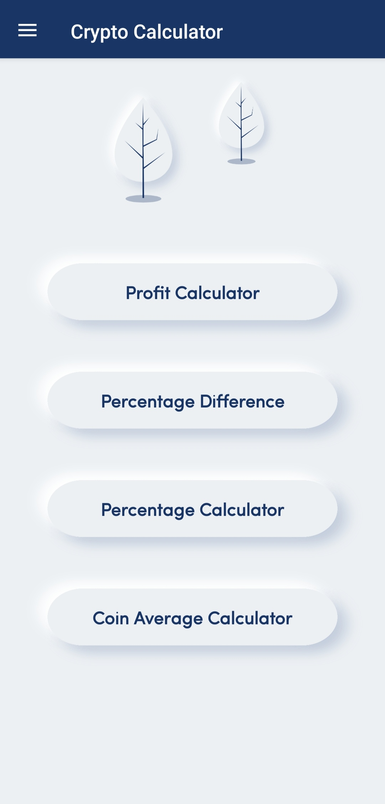
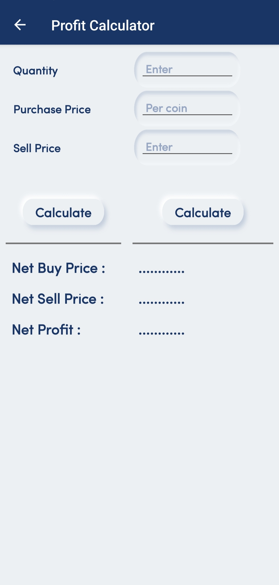
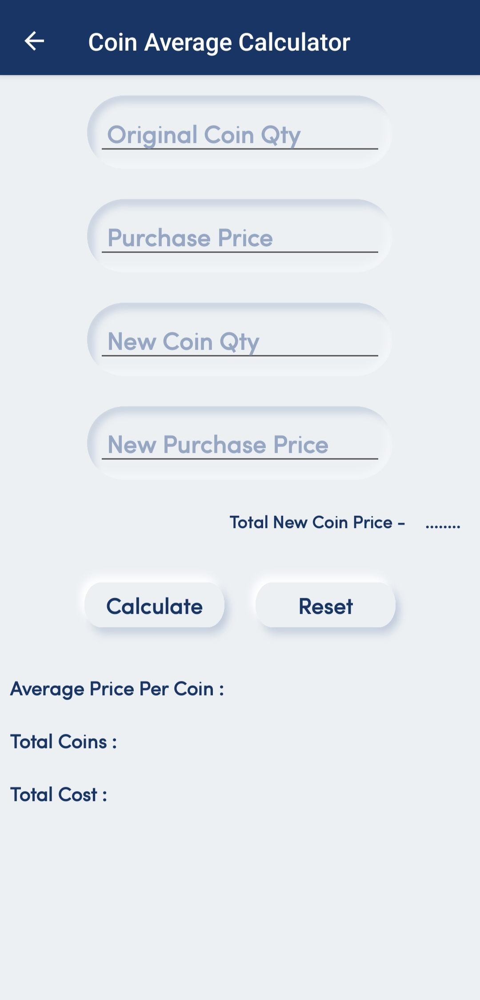
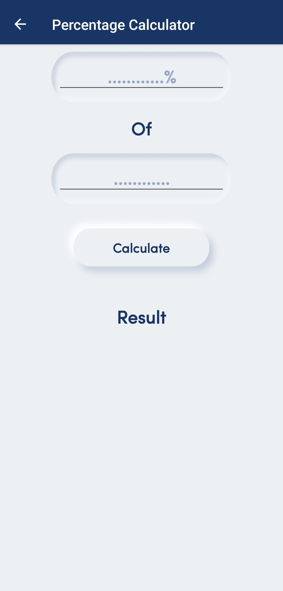

# Crypto-Analysis-App
"Crypto Analysis Calculator" is a mobile app that empowers users to calculate risk factors, potential profits, and losses in cryptocurrency investments. With intuitive tools for evaluating market trends, it provides detailed insights to help users make informed trading decisions. Perfect for beginners and seasoned traders alike.

 

 

 

 

